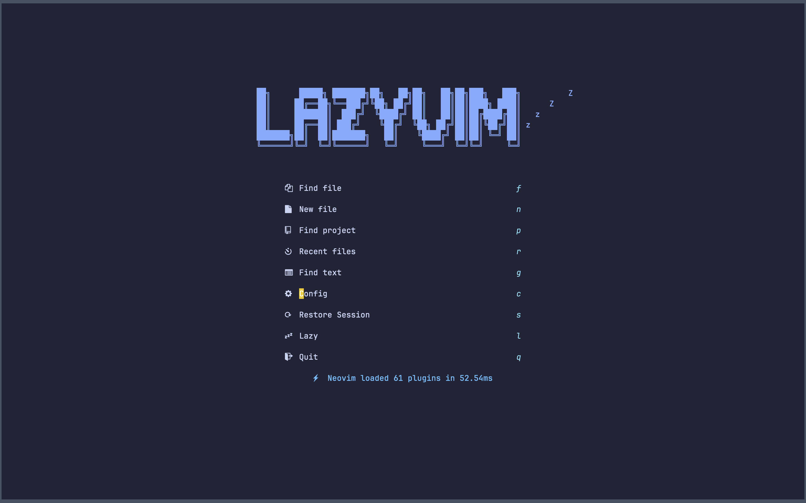

<h1 align="center">Welcome to nvim-for-webdev 👋</h1>
<p>
Are you a web developer working with JS, Typescript, React, and Tailwind CSS? Check out the Neovim and LazyVim plugin starter template!
</p>

[![IT Man - Talk #33 NeoVim as IDE [Vietnamese]](https://i.ytimg.com/vi/dFi8CzvqkNE/hqdefault.jpg)](https://www.youtube.com/watch?v=dFi8CzvqkNE)

[](https://www.youtube.com/watch?v=3EbgMJ-RcWY)

[![IT Man - Step-by-Step Guide: Integrating Copilot Chat with Neovim [Vietnamese]](https://i.ytimg.com/vi/By_CCai62JE/hqdefault.jpg)](https://www.youtube.com/watch?v=By_CCai62JE)

[](https://www.youtube.com/watch?v=2nt_qcchW_8)

[](https://www.youtube.com/watch?v=6oOPGaKCd_Q)

## Starter Template for Web Developers

This is a starter template for [LazyVim](https://github.com/LazyVim/LazyVim).
Refer to the [documentation](https://lazyvim.github.io/installation) to get started.

Find detailed resources for each plugin in the accompanying readme. Start your web development journey with Neovim and LazyVim today!

## Install Neovim

The easy way is using [MordechaiHadad/bob: A version manager for neovim](https://github.com/MordechaiHadad/bob).

```sh
bob install stable
bob use stable
```

## Install the config

Make sure to remove or move your current `nvim` directory

```sh
git clone https://github.com/jellydn/nvim-for-webdev.git ~/.config/nvim
rm -rf ~/.config/nvim/.git
```

### Usage with NVIM_APPNAME

```sh
git clone https://github.com/jellydn/nvim-for-webdev.git ~/.config/nvim_webdev
alias web_nvim="NVIM_APPNAME=nvim_webdev nvim"
web_nvim
```

You should restart Neovim to apply the changes after installing the starter template.

## Extra plugins from LazyVim

Add below plugins to [lazy.lua](./lua/config/lazy.lua), more detail on https://www.lazyvim.org/plugins

```lua
    { import = "lazyvim.plugins.extras.test.core" },
    { import = "lazyvim.plugins.extras.lang.json" },
    { import = "lazyvim.plugins.extras.lang.tailwind" },
    { import = "lazyvim.plugins.extras.util.mini-hipatterns" },
    { import = "lazyvim.plugins.extras.ui.edgy" },
    { import = "lazyvim.plugins.extras.linting.eslint" },
    { import = "lazyvim.plugins.extras.lang.yaml" },
    { import = "lazyvim.plugins.extras.lang.typescript" },
    { import = "lazyvim.plugins.extras.coding.codeium" },
    { import = "lazyvim.plugins.extras.coding.copilot" },
    { import = "lazyvim.plugins.extras.coding.tabnine" },
    { import = "lazyvim.plugins.extras.ui.alpha" },
    { import = "lazyvim.plugins.extras.lsp.none-ls" },
```

## [Keymaps](./lua/config/keymaps.lua)

- Add custom mappings for quickly exiting insert mode, closing buffers, opening the Alpha dashboard, displaying NullLs info, and toggling certain features of the Gitsigns and Todo Comments plugins.

## UI

### Dashboard



### Folding

- Add [UFO folding and hover to preview](./lua/plugins/2-folding.lua)

## Setup [IDE](./lua/plugins/1-coding.lua)

This IDE setup includes several plugins for Neovim that provide features such as autocompletion, documentation generation, and formatting. The setup includes the Codeium plugin, which is a competitor to GitHub Copilot, as well as the Tabnine autocompletion plugin. Additionally, the setup includes the vim-jsdoc plugin for generating documentation, and plugins for sorting Tailwind CSS classes using Rustywind and null-ls.nvim.

### Resources

- https://codeium.com/compare/comparison-copilot-codeium
- https://github.com/Exafunction/codeium.vim
- https://www.tabnine.com/blog/tabnine-vs-github-copilot/
- https://github.com/tzachar/tabnine-vim
- https://github.com/codota/tabnine-nvim
- https://github.com/heavenshell/vim-jsdoc
- https://github.com/avencera/rustywind

### Tutorial

- [LazyVim: Linting and Formatting](https://www.youtube.com/watch?v=a_ZpTPaSn38)
- [LazyVim: Tailwind CSS Support](https://www.youtube.com/watch?v=_NiWhZeR-MY)
- [How to use NVIM_APPNAME for Neovim Switcher](./Neovim_Switcher.md)

[![IT Man - Tip #38 - Learning Vim with VSCode - A Comprehensive Guide [Vietnamese]](https://i.ytimg.com/vi/yTTPRm0ACl0/hqdefault.jpg)](https://www.youtube.com/watch?v=yTTPRm0ACl0)
[![IT Man - Eliminate Typos in Your Code with Neovim [Vietnamese]](https://i.ytimg.com/vi/3IwMd77_P8E/hqdefault.jpg)](https://www.youtube.com/watch?v=3IwMd77_P8E)

## Author

👤 **Huynh Duc Dung**

- Website: https://productsway.com/
- Twitter: [@jellydn](https://twitter.com/jellydn)
- Github: [@jellydn](https://github.com/jellydn)

## Show your support

Give a ⭐️ if this project helped you!

[](https://ko-fi.com/dunghd)
[](https://paypal.me/dunghd)
[](https://www.buymeacoffee.com/dunghd)
